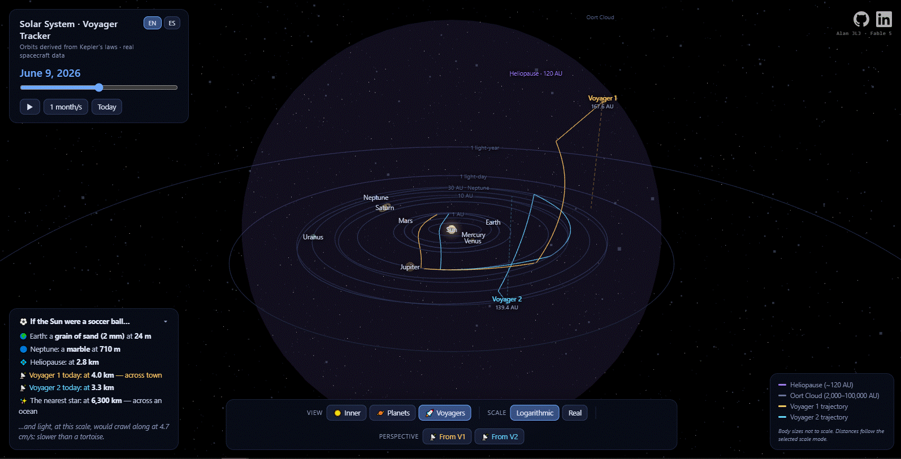

# 🛰️ Sistema Solar 3D · Rastreador Voyager

**Una visualización 3D interactiva del sistema solar, impulsada por física real, que rastrea la posición verdadera de las Voyager 1 y 2 en el espacio interestelar — hoy, y en cualquier fecha entre 1977 y 2076.**

[](#)
[](#-licencia)
[](https://www.anthropic.com/claude/fable)

🌐 **[Read this in English →](README.md)**

---

## 📸 Demo / Vista previa



> **Para agregar la vista previa:** crea una carpeta `assets/`, graba una captura corta de la app (por ejemplo con [ScreenToGif](https://www.screentogif.com/) o `Win + Alt + R`), guárdala como `assets/demo.gif`, y la imagen de arriba se mostrará automáticamente.

---

## 🌌 Acerca del Proyecto

La mayoría de los diagramas del sistema solar te mienten. No les queda alternativa: a escala real, si el Sol fuera un balón de fútbol, la Tierra sería un grano de arena a 24 metros, y las sondas Voyager estarían al otro lado de tu ciudad.

Este proyecto se niega a aplanar esa verdad. Es un **único archivo HTML autocontenido** que renderiza el sistema solar en proporción real, deriva cada órbita planetaria de las **leyes de Kepler** (sin posiciones precalculadas) y ubica a la **Voyager 1 (~165+ AU, rumbo a Ofiuco)** y a la **Voyager 2 (~137+ AU, rumbo a Pavo)** usando sus velocidades heliocéntricas reales y sus trayectorias asintóticas — incluidas las asistencias gravitatorias que doblaron su camino en Júpiter, Saturno, Urano y Neptuno.

El objetivo es simple y ambicioso: que cualquier persona — un estudiante de preparatoria, un reclutador, tú — pueda pasar cinco minutos dentro y salir *sintiendo* la escala del espacio y la magnitud de lo que lograron las misiones Voyager.

Lo que lo hace especial:

- **Física real, no fotogramas de animación.** Las posiciones planetarias se resuelven cada cuadro a partir de elementos orbitales mediante la ecuación de Kepler; los períodos orbitales emergen de la tercera ley de Kepler y las velocidades de la ecuación vis-viva.
- **Datos reales de las sondas.** Las distancias, rumbos, velocidades, fechas de lanzamiento y cruces de la heliopausa coinciden con el registro publicado de la misión.
- **Escala intercambiable.** El modo logarítmico permite ver Mercurio y el espacio interestelar en una sola vista; el modo lineal ("real") muestra cómo los planetas se desvanecen en un punto dentro de la heliosfera — que es exactamente la idea.
- **La vista desde la propia sonda.** El modo "Perspectiva Voyager" coloca la cámara a bordo de cada nave, donde el Sol queda reducido a la estrella más brillante de un cielo negro.

---

## ✨ Funcionalidades

- 🪐 **Motor orbital kepleriano** — los 8 planetas propagados desde elementos orbitales J2000 del JPL, resueltos numéricamente cada cuadro
- 🚀 **Rastreo en vivo de Voyager 1 y 2** — distancia, tiempo-luz y velocidad reales para cualquier fecha simulada
- 🛤️ **Trayectorias históricas** — rutas de vuelo trazadas desde el lanzamiento (1977), pasando por cada asistencia gravitatoria real, hasta la fecha actual
- ⏱️ **Máquina del tiempo** — recorre de 1977 a 2076, o reproduce a velocidades de 1 día/s hasta 5 años/s
- 🔭 **Modo Perspectiva Voyager** — ve el Sol como un punto de luz a 165 AU, con cifras en vivo de brillo y retraso de la luz
- 📏 **Doble modo de escala** — logarítmica (todo en una vista) vs. proporción real (siente el vacío)
- 🫧 **Contexto interestelar** — heliopausa (~120 AU), nube de Oort (2,000–100,000 AU), anillos de referencia de día-luz y año-luz
- 🖱️ **Exploración libre total** — rota, acerca y desplaza; haz clic en cualquier cuerpo para abrir su panel de datos en vivo; pasa el cursor para ver distancia, tiempo-luz y velocidad
- ⚽ **Tarjeta de escala tangible** — comparaciones tipo "si el Sol fuera un balón de fútbol…", actualizadas en vivo con la fecha de simulación
- 🌐 **Interfaz bilingüe** — inglés por defecto, español con un clic, cubriendo cada etiqueta hasta las anotaciones 3D dentro de la escena
- 📦 **Cero instalación** — un archivo HTML, sin backend, sin paso de compilación

---

## 🛠️ Construido Con

| Tecnología | Rol |
|---|---|
| [Three.js](https://threejs.org/) r160 | Renderizado WebGL, controles de cámara (`OrbitControls`), etiquetas ancladas en HTML (`CSS2DRenderer`) |
| JavaScript puro (Módulos ES) | Lógica de la aplicación, solucionador de Kepler, i18n — sin frameworks |
| HTML5 + CSS3 | Entrega en un solo archivo, paneles de interfaz con glassmorphism |
| Datos de NASA / JPL | Elementos orbitales y parámetros de la misión Voyager (ver [Fuentes de Datos](#-fuentes-de-datos)) |

### Acerca de Claude Fable 5

Este proyecto fue construido con **[Claude Fable 5](https://www.anthropic.com/claude/fable)**, el primer modelo clase Mythos de Anthropic disponible al público (lanzado en junio de 2026). Fable 5 fue el motor principal de ingeniería del proyecto: diseñó la arquitectura, implementó la mecánica kepleriana y el modelo de trayectorias, escribió e iteró el código de renderizado e interfaz, y verificó visualmente cada build en un navegador headless hasta que el resultado coincidió con la intención. El autor dirigió la visión, los requisitos y la revisión; Fable 5 hizo el trabajo pesado en el teclado.

---

## 🚀 Cómo Empezar

Es un único archivo HTML autocontenido. Sin instalación, sin dependencias, sin paso de compilación.

**Opción 1 — Simplemente ábrelo**

```
Doble clic en index.html
```

Eso es todo. Se necesita conexión a internet en la primera carga (Three.js se descarga desde un CDN).

**Opción 2 — Sírvelo localmente** (recomendado si tu navegador restringe archivos locales)

```bash
# Python
python -m http.server 8000

# o Node
npx serve .
```

Luego abre `http://localhost:8000`.

**Controles:** arrastra para rotar · rueda para acercar · clic en cualquier cuerpo para ver detalles · usa la barra inferior para vistas, modos de escala y perspectivas Voyager · usa el panel superior izquierdo para viajar en el tiempo.

---

## 📡 Fuentes de Datos

- **Elementos orbitales planetarios** — [JPL "Approximate Positions of the Planets"](https://ssd.jpl.nasa.gov/planets/approx_pos.html) (elementos keplerianos, época J2000)
- **Referencia de efemérides** — [Sistema Horizons de NASA/JPL](https://ssd.jpl.nasa.gov/horizons/)
- **Distancias, velocidades y trayectoria de las Voyager** — [NASA JPL Voyager Mission Status](https://voyager.jpl.nasa.gov/mission/status/)
- **Cruces de la heliopausa** — anuncios de la NASA: Voyager 1 (25 ago 2012), Voyager 2 (5 nov 2018)
- **Constantes físicas** — definiciones de la IAU (1 AU = 149,597,870.7 km; c = 299,792.458 km/s)

El movimiento planetario se *deriva* de estos elementos resolviendo la ecuación de Kepler en tiempo de ejecución — ninguna posición está precalculada. Las posiciones de las Voyager usan sus velocidades heliocéntricas publicadas y sus direcciones asintóticas (Ofiuco, +35° de latitud eclíptica para la V1; Pavo, −48° para la V2), con trayectorias que pasan por las posiciones verdaderas de los planetas en cada fecha histórica de sobrevuelo.

---

## 👨‍🚀 Autor

**Alan Jesús López Jacinto**

- GitHub: [@alanjlj2202](https://github.com/alanjlj2202)
- LinkedIn: [Alan Jesús López Jacinto](https://www.linkedin.com/in/alan-jesús-lópez-jacinto-66a699253/)

---

## 🙏 Agradecimientos

- **[Anthropic](https://www.anthropic.com/)** y el equipo de **Claude Fable 5** — por construir un modelo capaz de convertir una idea sobre la escala cósmica en software funcional y verificado dentro de una sola conversación.
- **La misión Voyager de la NASA** — casi cinco décadas de ingeniería, y los dos embajadores más lejanos que la humanidad ha enviado jamás. El Disco de Oro sigue allá afuera, alejándose a 17 km/s.
- **Los contribuidores de [Three.js](https://threejs.org/)**, por hacer que WebGL se sienta como escritura creativa.

> *"La nave será encontrada y el disco será escuchado solo si existen civilizaciones avanzadas que viajen por el espacio interestelar. Pero lanzar esta botella al océano cósmico dice algo muy esperanzador sobre la vida en este planeta."* — Carl Sagan
